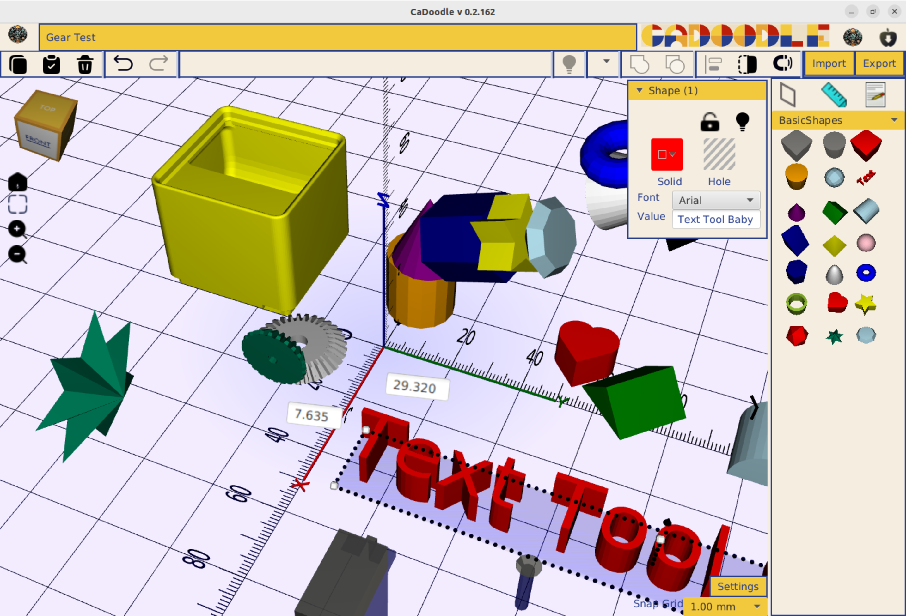

# CaDoodle
A free and open source CAD package using drag-and-drop shapes. 

# Download

[Download and Install here](https://github.com/CommonWealthRobotics/CaDoodle/releases)

# Source Code

This repository is the installer and auto-updater. The installable releases are found here. 

The below link is for the source code of the main application itself.

https://github.com/CommonWealthRobotics/CaDoodle-Application

# Inspiration

The workflow of Tinkercad is an excellent experience for novice users of CAD. 

1. Drag and drop shape
2. Group and ungroup
3. Solid and Hole status
4. Undo of operations
5. Stretch and move handles
6. Library of examples
7. Nearest Surface snappping

This workflow suffers from a few fundemental problems

1. Web based UI means it is enclosed by whomever runs the server
2. Subscription model is precarious (Autodesk is not known as a reliable partner for free tools over time)
3. Proprietary source files

# Solution 

This application is Java based and uses BowerStudio as the CAD kernel.

All scripts will be compatible BowlerStudio scripts. 

UI will be laid out in SceneBuilder / JavaFX.

OpenJDK 17 

# Hardware Requirements

The following platforms will be targeted:

* Windows
* Mac OS (Intel and Aarch64)
* Linux Ubuntu .deb and flatpack)
* ChromeOS
* 8 gb of ram is required.
  
The following platforms will not be targeted:

* Androind
* iOS

## Chrome OS Instructions

First, set up Linux using the instructions : https://support.google.com/chromebook/answer/9145439?hl=en

Next download the Linux .DEB installer from : https://github.com/CommonWealthRobotics/CaDoodle/releases

Finally double-click on the .DEB to install CaDoodle.

You can now launch CaDoodle from the applications launcher window. 

 
  
