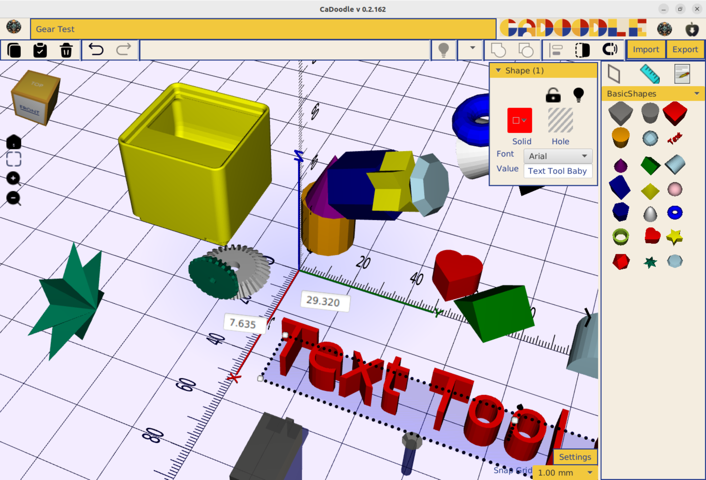

# Cadoodle Website

[https://cadoodlecad.com/](https://cadoodlecad.com/)


# CaDoodle
A free and open source CAD package using drag-and-drop shapes. 

Installers: []() 

Application: []()



# Download

[Download and Install here](https://github.com/CommonWealthRobotics/CaDoodle/releases)

# Source Code

This repository is the installer and auto-updater. The installable releases are found here. 

The below link is for the source code of the main application itself.

https://github.com/CommonWealthRobotics/CaDoodle-Application

# Windows install

For silent local installs

```

CaDoodle-Windows-x86_64.exe /Q 

```

For silent system installs

```

CaDoodle-Windows-System-x86_64.exe /Q 

CaDoodle-Windows-System-x86_64.exe /Q /D=D:\CustomLocation\CaDoodle\

```

### Windows debugging

Open PowerShell (not cmd)

```
& "Documents\CaDoodle-Windows-x86_64\CaDoodle\CaDoodle.exe" 2>&1 | Tee-Object -filePath Documents\output.txt
```

# Plugins

CaDoodle uses a set of plugins to extend capabilities. 

Plugin bundles can be found here

https://github.com/CommonWealthRobotics/bowler-script-kernel/releases

### Pre-Install plugins

The plugins zip file can be downloaded and pre-installed on the system. The zip file can be selected when the installer asks the user to select a file

For system Administrators, the zip file for a given system can be downloaded and placed in the install directory next to `CaDoodle-ApplicationInstall.zip` . When this file is present, it will be auto selected on fresh installs, and when the globalPinVersion is set, then the user will automatically get the current plugins and LTS version of CaDoodle. 

### Mac Plugins

```
brew install --cask inkscape blender freecad meshlab openscad@snapshot
```

### Ubuntu Plugins

```
sudo apt update

sudo apt install -y \
    wget \
    freecad \
    inkscape \
    blender \
    meshlab

wget -qO- https://files.openscad.org/OBS-Repository-Key.pub | \
    sudo tee /etc/apt/trusted.gpg.d/obs-openscad-nightly.asc > /dev/null

echo "deb https://download.opensuse.org/repositories/home:/t-paul/xUbuntu_26.04/ ./" | \
    sudo tee /etc/apt/sources.list.d/openscad.list

sudo apt update
sudo apt install -y openscad-nightly
```

### Flatpack Plugins

```
sudo apt update
sudo apt install -y flatpak

sudo flatpak remote-add --if-not-exists flathub \
    https://flathub.org/repo/flathub.flatpakrepo

flatpak install -y flathub \
    org.freecad.FreeCAD \
    org.openscad.OpenSCAD \
    org.inkscape.Inkscape \
    org.blender.Blender
    
```


# Visual Studio Code building the Java JAR file

To build the updater Java JAR file in Visual Studio Code install the following extensions:
1. Gradle for Java
2. Language Support for Java(TM) by Red Hat

Open the CaDoodleUpdater directory.

When VS Code asks to use Gradle or Maven, select Gradle.

To build the JAR file the Azul 25 Java-JavaFX JVM is required, it can be found here:
https://www.azul.com/downloads/?version=java-17-lts&package=jdk-fx#zulu

Supported platforms are Windows-x64, Linux-x64, Linux-ARM, Mac-x64 and Mac-ARM.
Extract the JVM to a path without spaces in it.

In the VS Code "settings.json" point to the files in the JVM:
```
"java.jdt.ls.java.home": "<YOUR_PATH>",
"java.configuration.runtimes": "<YOUR_PATH>"
```

Both paths can point to the same directory (the JRE is included in the JVM).
The java executable (java or java.exe) should be located in:
```"<YOUR_PATH>\\bin\\"```

Select the Gradle extension (elephant icon on the left), then select "CaDoodleUpdater/Tasks/build/build" to build the Jar file.
The CaDoodleUpdater.jar file will be located in "CaDoodleUpdater\build\libs"


# Plugins 

the list of plugind needed are:

https://github.com/CommonWealthRobotics/ExternalEditorsBowlerStudio

Check out the content of the .json files for exact URLs and versions

Plugins can also be installed natively on the system and CaDoodle will find them installed there. This is the best choice for all of the MacOS plugins because of the security restrictions on applications. 

# Apple Store

Coming soon...
